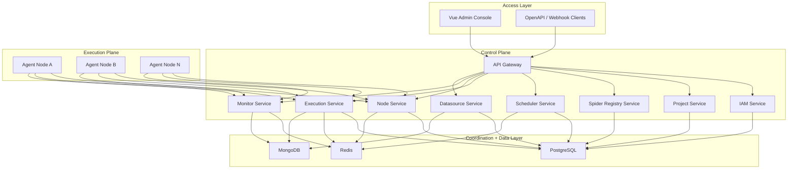

# Crawler Platform V1 Design

## 1. Document Scope

This document defines the V1 product and system design for a distributed crawler monitoring and management platform inspired by Crawlab, but implemented with a new architecture and technology stack:

- Backend: Go
- Frontend: Vue 3 + TypeScript
- Deployment: Docker Compose first, distributed deployment supported
- Datastores: PostgreSQL + Redis + MongoDB
- Runtime support: Go spiders and Python spiders

This is a V1 design document, not a smallest-possible MVP note. The design covers the full V1 platform blueprint while still defining phased delivery boundaries for implementation.

## 2. Product Positioning

The platform is a distributed crawler control plane for managing the full lifecycle of crawler execution:

- Spider registration and version management
- Manual and scheduled task execution
- Distributed node scheduling and execution
- Task log viewing and execution tracing
- Node health and runtime monitoring
- Database connection management and data preview

The first production target is internal use, but the architecture must preserve a clear upgrade path to a future productized platform with stronger tenant isolation, richer permissions, and more advanced operations tooling.

## 3. Design Principles

The system should follow these principles:

1. Control plane and execution plane are separated.
2. Microservices are introduced early, but service count is intentionally bounded.
3. Docker is the default execution mode; host execution remains as a compatibility path.
4. PostgreSQL holds business truth, Redis coordinates short-lived runtime state, and MongoDB stores flexible runtime records and logs.
5. Project is the primary resource isolation boundary in V1.
6. The platform manages crawler lifecycle, not crawler business logic.

## 4. Scope Boundary

### 4.1 In Scope for V1

- User login and role-based access control
- Project-based resource isolation
- Spider registration for Go and Python
- Spider version management
- Manual execution and scheduled execution
- Retry policy and execution history
- Distributed node registration and heartbeat
- Docker runtime and host runtime support
- Task-level and node-level monitoring
- Real-time and historical log viewing
- MongoDB, Redis, and PostgreSQL datasource management
- Database structure browsing and safe data preview
- Docker Compose deployment for the control plane

### 4.2 Out of Scope for V1

- Full multi-tenant SaaS model
- Kubernetes-native deployment
- Full alert center and notification orchestration
- Workflow/DAG visual orchestration
- Complete DBA-grade query console
- Full APM or tracing platform

## 5. Target Users

### 5.1 Platform Administrator

Responsible for:

- system configuration
- user and role management
- node fleet management
- global datasource governance
- audit visibility

### 5.2 Project Administrator

Responsible for:

- project membership
- spider and task configuration
- project-level environment variables
- resource binding

### 5.3 Spider Developer

Responsible for:

- registering Go and Python spiders
- publishing versions
- running debug tasks
- checking logs and execution failures

### 5.4 Operations / On-call Personnel

Responsible for:

- monitoring execution status
- checking node health
- investigating failed jobs
- recovering task execution

## 6. Product Information Architecture

The frontend console should be organized into the following top-level modules:

- Dashboard
- Projects
- Spiders
- Tasks
- Executions
- Nodes
- Monitor
- Datasources
- System

### 6.1 Dashboard

Provides global operational visibility:

- execution counts
- success rate
- recent failures
- active nodes
- active projects
- task trend charts

### 6.2 Projects

Provides project-based management:

- project list
- members and roles
- environment variables
- tags
- resource binding overview

### 6.3 Spiders

Provides spider registration and version management:

- spider list
- create/edit spider
- version management
- runtime configuration
- debug run entry

### 6.4 Tasks

Provides scheduling and task configuration:

- manual tasks
- cron tasks
- retry policies
- trigger history

### 6.5 Executions

Provides execution tracking:

- execution record list
- status filtering
- execution detail
- runtime logs
- exit code
- node reference
- runtime snapshot

### 6.6 Nodes

Provides execution node management:

- node list
- online status
- labels and capabilities
- resource metrics
- running task count
- node detail

### 6.7 Monitor

Provides aggregated monitoring:

- task success trend
- failure ranking
- slow execution ranking
- node health trend
- abnormal event view

### 6.8 Datasources

Provides datasource management and preview:

- datasource list
- create/test connection
- schema browsing
- preview query
- result table or JSON view

### 6.9 System

Provides platform-level configuration:

- users and roles
- audit logs
- platform config
- health summary

## 7. Architecture Decision

The chosen architecture is an early microservice model.

This was selected because:

- the project is not rushed for immediate launch
- future long-term maintainability matters more than short-term speed
- domain boundaries should be established early
- the platform is expected to evolve toward stronger productization later

The trade-off is higher initial complexity. This is acceptable as long as service boundaries remain disciplined.

## 8. High-Level System Architecture

The platform is split into four layers:

1. Access Layer
2. Control Plane
3. Coordination/Data Layer
4. Execution Plane



## 9. Service Boundaries

### 9.1 API Gateway

Responsibilities:

- external entry point
- authentication verification passthrough
- routing
- request tracing
- basic rate limiting
- unified API response style

The frontend communicates only with the gateway.

### 9.2 IAM Service

Responsibilities:

- login
- user management
- role management
- permission checks
- audit event production

Initial auth mode:

- local account login
- JWT-based access

Future extension points:

- LDAP
- OAuth2 / SSO

### 9.3 Project Service

Responsibilities:

- project CRUD
- project members
- project roles
- project environment variables
- project tags
- project-level resource ownership

Project is the main isolation unit in V1.

### 9.4 Spider Registry Service

Responsibilities:

- spider definition management
- spider version management
- runtime specification validation
- artifact metadata registration

It defines what can be executed, but it does not run tasks directly.

### 9.5 Scheduler Service

Responsibilities:

- manual triggers
- cron triggers
- retry triggers
- scheduling policies
- dispatch event creation

It decides when a task should run, not how the task runs on a node.

### 9.6 Execution Service

Responsibilities:

- execution instance lifecycle
- execution state machine
- dispatch coordination
- cancellation and stop requests
- log indexing
- runtime result persistence

This is the core orchestration service between scheduler and agents.

### 9.7 Node Service

Responsibilities:

- agent registration
- node capability management
- heartbeat tracking
- node status and labels
- node availability metadata

### 9.8 Monitor Service

Responsibilities:

- task-level metrics query
- node-level metrics query
- failure trend query
- execution aggregation views

The monitor service focuses on operational visibility, not on control actions.

### 9.9 Datasource Service

Responsibilities:

- datasource registration
- connection test
- schema metadata browsing
- safe preview query execution
- preview limits and query governance

## 10. Execution Plane Design

Each execution node runs one Agent service.

The Agent contains four internal components:

- Heartbeat Reporter
- Task Runner
- Log Collector
- Metric Reporter

### 10.1 Agent Responsibilities

- register itself to the control plane
- report capabilities and host metrics
- pull executable jobs
- run jobs via docker or host runtime
- collect runtime logs
- report execution status back

### 10.2 Runtime Modes

The system supports two execution modes:

#### Docker Runtime

Recommended default mode.

Benefits:

- better isolation
- easier environment consistency
- more predictable deployment
- easier future scaling

#### Host Runtime

Compatibility mode.

Use cases:

- environments without container execution
- debugging on trusted nodes
- special runtime requirements

Risks:

- environment drift
- dependency inconsistency
- harder reproducibility

### 10.3 Language Support

The platform supports:

- Go spiders
- Python spiders

Both languages are normalized under a shared `RuntimeSpec` abstraction so that scheduling logic remains language-neutral.

## 11. Service Communication Design

### 11.1 Synchronous Communication

- Frontend to Gateway: REST + WebSocket
- Gateway to internal services: REST
- Internal service to internal service: primarily gRPC, with REST allowed for low-complexity admin flows

### 11.2 Asynchronous Communication

Redis is used for:

- scheduling queue
- temporary dispatch coordination
- distributed locking
- hot cache
- short-lived runtime state

### 11.3 Agent Communication Model

V1 should use an Agent Pull Model.

Flow:

1. Scheduler produces runnable work.
2. Execution Service records and exposes pending execution tasks.
3. Agent polls for executable jobs it can run.
4. Agent starts execution and reports status back.

Reasons for choosing pull:

- easier deployment across private networks
- no requirement for reverse connectivity from the control plane to the node
- simpler node onboarding

## 12. Data Storage Responsibilities

### 12.1 PostgreSQL

Stores transactional and authoritative platform data:

- users
- roles
- projects
- project membership
- spider definitions
- spider versions
- task definitions
- execution primary records
- node registration metadata
- datasource configuration metadata
- audit records

### 12.2 Redis

Stores short-lived coordination data:

- task queues
- distributed locks
- temporary node state
- cache
- lightweight session or stream coordination

Redis must not hold long-term business truth.

### 12.3 MongoDB

Stores flexible runtime and operational records:

- execution logs
- stdout/stderr chunks
- execution result summaries
- monitoring snapshots
- preview record cache
- debug runtime context

MongoDB must not replace PostgreSQL for permission or transaction-heavy data.

## 13. Monitoring Design

V1 monitoring covers two levels:

- task-level monitoring
- node-level monitoring

### 13.1 Task-Level Monitoring

Required views:

- status
- start and finish times
- duration
- failure reason
- retry history
- log stream

### 13.2 Node-Level Monitoring

Required views:

- online status
- last heartbeat time
- CPU usage
- memory usage
- disk usage
- running task count
- node exception state

### 13.3 Explicit Monitoring Boundary

Not included in V1:

- full application performance monitoring
- full distributed tracing
- full alert rule center

The monitoring focus is operational diagnosis efficiency.

## 14. Datasource Center Design

The datasource center supports:

- MongoDB
- Redis
- PostgreSQL

### 14.1 Capabilities

- connection configuration
- connection testing
- structure browsing
- limited data preview

### 14.2 Safety Constraints

V1 must enforce:

- read-only preview by default
- request timeout
- result row limits
- restricted query grammar
- audit for preview operations

Specific constraints:

- PostgreSQL: preview limited to `SELECT`
- MongoDB: limited filtered query and paging preview
- Redis: key browsing and sampled value preview only, no dangerous full scans

## 15. Core Business Flows

### 15.1 Register and Publish Spider

1. Developer creates a spider.
2. Developer chooses language type.
3. Developer submits runtime configuration and entrypoint.
4. Spider Registry validates the runtime specification.
5. Version becomes available for task binding.

### 15.2 Execute a Task

1. User triggers a manual or scheduled task.
2. Scheduler creates a job event.
3. Execution Service creates an execution record.
4. Eligible Agent pulls the job.
5. Agent starts docker or host runtime.
6. Agent streams logs and status.
7. Execution record is finalized.

### 15.3 Diagnose a Failed Run

1. Operator sees failed execution in Monitor or Executions.
2. Operator opens execution detail.
3. Operator checks logs, exit code, node, runtime snapshot.
4. Operator decides retry, debug run, or rollback version.

### 15.4 Preview Datasource Data

1. User selects a datasource.
2. User browses schema or key space.
3. User submits a safe preview request.
4. Datasource Service executes under guardrails.
5. Result is returned in tabular or JSON form.

## 16. Data Model Draft

### 16.1 User

- id
- username
- password_hash
- status
- last_login_at

### 16.2 Role

- id
- scope
- code
- name

### 16.3 Project

- id
- name
- code
- description
- status

### 16.4 Spider

- id
- project_id
- name
- language
- type
- description

### 16.5 SpiderVersion

- id
- spider_id
- version
- entrypoint
- runtime_type
- runtime_spec_json
- artifact_uri
- status

### 16.6 Task

- id
- project_id
- spider_id
- spider_version_id
- trigger_type
- cron_expr
- retry_policy_json
- enabled

### 16.7 Execution

- id
- task_id
- spider_version_id
- node_id
- status
- trigger_source
- started_at
- finished_at
- exit_code
- error_message
- runtime_snapshot_json

### 16.8 Node

- id
- name
- host
- status
- labels_json
- capabilities_json
- last_heartbeat_at

### 16.9 Datasource

- id
- project_id
- type
- name
- config_encrypted
- readonly
- status

### 16.10 AuditLog

- id
- operator_id
- project_id
- action
- target_type
- target_id
- detail_json
- created_at

## 17. API Draft

### 17.1 Auth

- `POST /api/v1/auth/login`
- `GET /api/v1/auth/me`

### 17.2 Projects

- `GET /api/v1/projects`
- `POST /api/v1/projects`
- `GET /api/v1/projects/:id`
- `POST /api/v1/projects/:id/members`

### 17.3 Spiders

- `GET /api/v1/projects/:projectId/spiders`
- `POST /api/v1/projects/:projectId/spiders`
- `POST /api/v1/spiders/:id/versions`
- `POST /api/v1/spiders/:id/debug-run`

### 17.4 Tasks

- `GET /api/v1/projects/:projectId/tasks`
- `POST /api/v1/projects/:projectId/tasks`
- `POST /api/v1/tasks/:id/run`
- `POST /api/v1/tasks/:id/enable`
- `POST /api/v1/tasks/:id/disable`

### 17.5 Executions

- `GET /api/v1/executions`
- `GET /api/v1/executions/:id`
- `POST /api/v1/executions/:id/cancel`
- `GET /api/v1/executions/:id/logs`
- `GET /api/v1/executions/:id/stream`

### 17.6 Nodes

- `GET /api/v1/nodes`
- `GET /api/v1/nodes/:id`
- `POST /api/v1/nodes/:id/drain`
- `POST /api/v1/nodes/:id/enable`

### 17.7 Datasources

- `GET /api/v1/datasources`
- `POST /api/v1/datasources`
- `POST /api/v1/datasources/:id/test`
- `GET /api/v1/datasources/:id/schema`
- `POST /api/v1/datasources/:id/preview`

## 18. Frontend Technical Recommendation

Recommended stack:

- Vue 3
- TypeScript
- Vite
- Pinia
- Vue Router
- Naive UI or Element Plus
- ECharts
- Monaco Editor optional for SQL/JSON preview editing

State strategy:

- app-level store for auth and current project
- domain store for spiders, tasks, nodes, datasources
- page-local reactive state for filters and transient UI state

## 19. Repository Layout Recommendation

The project should be created at:

`/home/iambaby/goland_projects/crawler-platform`

Recommended monorepo layout:

```text
crawler-platform/
  apps/
    web/
    gateway/
    iam-service/
    project-service/
    spider-service/
    scheduler-service/
    execution-service/
    node-service/
    monitor-service/
    datasource-service/
    agent/
  packages/
    go-common/
      auth/
      errors/
      logger/
      middleware/
      model/
      pagination/
      redisx/
      pgx/
      mongox/
      proto/
    web-shared/
  deploy/
    docker-compose/
    env/
    scripts/
  docs/
    architecture/
    product/
    api/
    superpowers/
      specs/
  examples/
    spiders/
      go/
      python/
```

## 20. Deployment Recommendation

V1 deployment baseline is Docker Compose.

Control plane containers:

- frontend-web
- gateway-service
- iam-service
- project-service
- spider-service
- scheduler-service
- execution-service
- node-service
- monitor-service
- datasource-service
- postgres
- redis
- mongo

Execution plane node deployment:

- agent-service
- docker runtime optional but recommended
- local Go/Python runtime optional for host mode

## 21. Delivery Phasing

### 21.1 MVP

- login and basic RBAC
- project management
- spider registration
- manual execution
- agent registration and heartbeat
- basic docker and host runtime support
- execution detail and logs
- datasource config and basic preview

### 21.2 V1

- scheduled tasks
- retry strategies
- node routing by label/capability
- execution history filters
- spider version management
- monitoring dashboard
- datasource structure browsing
- audit logging

### 21.3 V2

- formal multi-tenant model
- alert center
- workflow orchestration
- Kubernetes support
- pluginized runtimes
- quota and stronger permission granularity

## 22. Key Risks

### 22.1 Microservice Oversplitting

The selected architecture increases flexibility, but it must remain bounded. V1 should not split additional low-value services such as reporting, notification, or plugin marketplace.

### 22.2 Runtime Fragmentation

Go and Python execution paths must be normalized under one runtime abstraction. If each language gets its own orchestration flow, the platform will become difficult to maintain.

### 22.3 Host Runtime Drift

Host mode is inherently less stable than containerized execution. The system should recommend Docker as the default and clearly mark host mode as compatibility execution.

### 22.4 Datasource Safety

Datasource preview can easily become an unsafe database console if boundaries are weak. V1 must enforce readonly access, audit logging, limits, and timeouts.

### 22.5 Log Retention Growth

Execution logs and monitoring snapshots can grow quickly in MongoDB. Retention policy, archival strategy, and cleanup tasks must be designed early.

## 23. Final Recommendation

The final recommended V1 direction is:

- architecture: early microservices
- frontend: Vue 3 + TypeScript
- backend: Go
- storage: PostgreSQL + Redis + MongoDB
- deployment: Docker Compose
- execution: Docker-first, host-compatible
- runtime languages: Go and Python
- observability scope: task-level and node-level monitoring
- product posture: internal-first with productization-ready boundaries

This design is suitable for planning and phased implementation.
